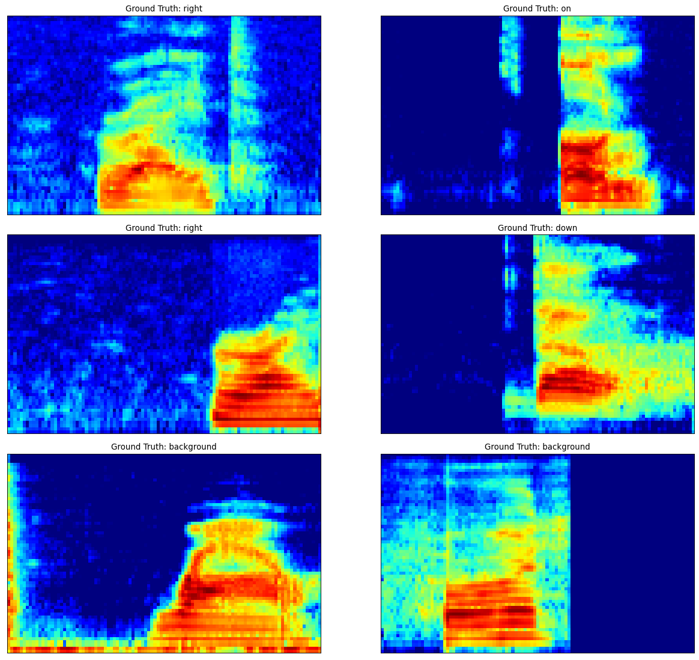
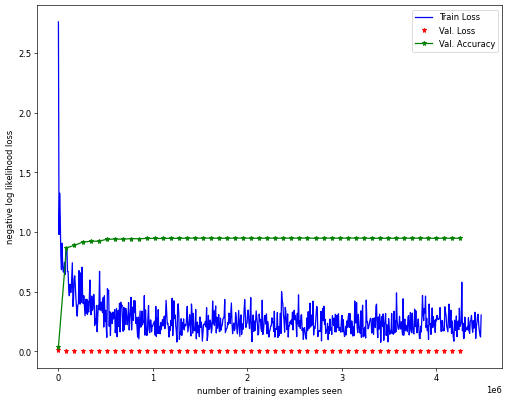
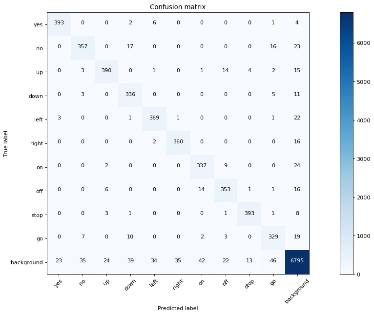

This is a tutorial post on speech commands recognition using the [Speech Commands dataset](https://arxiv.org/abs/1804.03209). The goals for this post

1. Work with audio data using torchaudio: look at spectrograms features and data augmentation
2. Train a model to recogize audio data from a vocabulary of spoken commands
3. Evaluate model performance using measures like accuracy (error rate) and confusion matrix

There are around 10 speech commands like Yes, No, Up, Down and so on. The dataset contains wav files sampled at 16000 Hz and each command waveform contains upto a second of data. In addition to the commands themselves, there are some words that are not commands (and phonetically diverse) and background files containing background noise and silence segments.

We will rely heavily on the torchaudio package for input preprocessing. It has some convenient dataloaders and feature preprocessing transforms. The nice thing about torchaudio, is that the feature processing can take place on the GPU and this will accelerate the training process significantly.

To install torchaudio, the command below should be executed in a terminal:  
conda install -c pytorch torchaudio

The -c option searches on the pytorch channel.

This notebook is available on github at this [link].(https://github.com/jumpml/pytorch-tutorials/blob/master/SpeechCommands_CNN.ipynb)

## Data Setup

We have created a wrapper around torchaudio's SPEECHCOMMANDS dataset class. The wrapper performs the following steps for us

1. Create train, val and test splits of the dataset
2. Process the background noise files and creates 1 sec segments for augmenting each split
3. Pad the data to 1s and map the string labels to integer. Number 11 corresponds to background or unknown.
4. Creates dataloaders for each split with appropriate transforms (MelSpectrogram, etc.)

The torchaudio class automatically downloads the data if not already on disk. If we look at the source code for the speechcommands dataset class in torchaudio, we need to specify the version of speech commands (v0.2). The dataset is around 2.3GB in size. Each item in the dataloader consists of the following information:  
waveform, sample_rate, label, speaker_id, utterance_number.

In this tutorial, we are not using speaker_id or utterance_number. We are not downsampling the audio to 8kHz, which may be a good thing to do, since it is an effective way to throw away information that is not related to the task of recognizing commands. Most of the voice information is between 20 Hz to 3.6 kHz.

### Feature Pre-Processing

Torchaudio comes with several useful [transforms](https://pytorch.org/audio/transforms.html), which we can use to get our input features efficiently computed on GPU.

Here is the feature processing we use for training data

```python
self.train_transform = torch.nn.Sequential(
   torchaudio.transforms.MelSpectrogram(sample_rate=16000, n_fft=320, hop_length=160, n_mels=n_mels),
   torchaudio.transforms.FrequencyMasking(freq_mask_param=int(n_mels*0.2)),
   torchaudio.transforms.TimeMasking(time_mask_param=int(0.2 * 16000/160)),
   torchaudio.transforms.AmplitudeToDB(stype='power', top_db=80))
```

A spectrogram is used to map the a waveform to a time-frequency representation which is almost always used in any kind of speech processing. We use a hop length of 10ms and a FFT size of 20 ms. In order to keep our inputs small, we also employ mel filterbanks to get 64 features in total. Then we convert the spectrogram magnitude to log-power scale in dB with a minimum floor of -80 dB. In order to get more general features, we additionally apply Frequency and Time masking on the training set only.

```python
batch_size_train = 64
# Setup train, val and test dataloaders
sc_data = scd.SpeechCommandsData(train_bs=batch_size_train, test_bs=256, val_bs=256, n_mels=64)
```



## Model Specification

The model we use is not too complicated:  
Input X (B,1,64,101)  
--> 32 Conv2D(8,20) --> BatchNorm2D --> MaxPool2D(2) --> ReLU  
--> 8 Conv2D(4,10) --> BatchNorm2D --> MaxPool2D(2) --> ReLU  
--> Linear(128) --> BatchNorm1D --> ReLU  
--> Linear(11) --> LogSoftmax

where B is Batch Size, the arguments to Conv2D are input numChannels, output numChannels and kernel size.

```python
class model(nn.Module):
    def __init__(self):
        super(model, self).__init__()
        self.conv1 = nn.Conv2d(in_channels=1, out_channels=num_filters_conv1, kernel_size=C1_kernel_size)
        self.bn1   = nn.BatchNorm2d(num_filters_conv1)
        self.conv2 = nn.Conv2d(num_filters_conv1, num_filters_conv2, C2_kernel_size)
        self.bn2   = nn.BatchNorm2d(num_filters_conv2)
        self.fc1 = nn.Linear(fc1_in_size, fc1_out_size)
        self.bn3   = nn.BatchNorm1d(fc1_out_size)
        self.fc2 = nn.Linear(fc1_out_size, fc2_out_size)           # number of classes = 11

    def forward(self, x):
        x = F.relu(F.max_pool2d(self.bn1(self.conv1(x)), mp2d_size))
        x = F.relu(F.max_pool2d(self.bn2(self.conv2(x)), mp2d_size))
        x = x.view(-1, fc1_in_size)    # reshape
        x = F.relu(self.bn3(self.fc1(x)))
        #x = F.dropout(x, training=self.training)  # Apply dropout only during training
        x = self.fc2(x)
        return F.log_softmax(x, dim=1)

nnModel = model().to(device)       # Instantiate our model and move model to GPU if available
```

```python
model_parameters = filter(lambda p: p.requires_grad, nnModel.parameters())
params = sum([np.prod(p.size()) for p in model_parameters])
print(f'Model size: {params} parameters' )
```

    Model size: 213891 parameters

## Objective or Loss Function

In the model the final layer is a log-softmax function, in other words, we get a vector of per-utterance log probabilities or log-likelihoods. So the output of the model is basically
$$ \hat{y} = \log P(y | x) $$

If we combine this with the nll_loss, which stands for negative log-likelihood loss which basically does the following operation

$$
l(\hat{y},y) = -\hat{y}[y]
$$

where $y$ is the true class label in ${0,1,...,C-1}$. If the model predicted the correct command with probability 1.0, then this loss would be 0.0. Otherwise it would be a positive number. By combining log-softmax and NLL loss, we get the Cross Entropy Loss.

```python
# Define objective function
lossFn = F.nll_loss  #When we combine nll_loss and log_softmax we get a cross entropy loss
```

## Model Optimization or Training

The new parameters are the previous parameters with a step (proportional to learning rate $\mu$) in the direction (negative gradient of loss function w.r.t parameters) that reduces the loss function. In terms of math for a single labeled example $y$ and model prediction $\hat{y}$  
$$ W_n = W_{n-1} - \mu \nabla_{W} l(\hat{y},y) $$

For a batch of examples, we simply replace the loss above with some reduction such as the mean loss over the batch.

We will also apply **learning rate decay** on the initial learning rate. The StepLR function will apply a decay of $\gamma$ every step_size number of epochs to the exisiting learning rate in the optimizer.

```python
learning_rate = 0.1   # Learning rate for optimizer like SGD usually in [0.001, 0.1]
# Define optimization
optimizer = optim.SGD(nnModel.parameters(), lr=learning_rate, momentum=0.5)

# Apply decaying Learning Rate
scheduler = optim.lr_scheduler.StepLR(optimizer, step_size=5, gamma=0.25)
```

## Mechanics of Training

Basically has the following steps which we repeat until all batches of training data are consumed

1. Get a batch of inputs (X) and corresponding labels (y), move to device
2. Initialize gradients
3. Calculate loss function on current batch of inputs and labels
4. Calculate gradients by calling backward() on the loss function output
5. Update parameters by calling optimizer.step()

At the start of end of each epoch (when one complete round of training data has been used), the learning rate is decayed.

```python
train_losses = []
TrainLen = len(sc_data.train_loader.dataset)
def train(model, lossFn, optimizer, train_loader, log_frequency=100):
  model.train()
  for batch_idx, (X_train, y_train) in enumerate(train_loader):
    # Move to device
    X_train, y_train = X_train.to(device), y_train.to(device)
    # Initialize gradients
    optimizer.zero_grad()
    # Predict on current batch of data
    y_hat = model(X_train)
    # Calculate Average Loss
    loss = lossFn(y_hat, y_train)
    # Calculate Gradients
    loss.backward()
    # Update model parameters using SGD
    optimizer.step()
    if batch_idx % log_frequency == 0:
      print(f'Train  {batch_idx * len(X_train)}/{TrainLen} Loss:{loss.item()}\n')
      train_losses.append(loss.item())

  scheduler.step() # update learning rate for next call to train()
```

## Let's Train

```python
val_losses = []
n_epochs = 50
val_accuracy = np.zeros(n_epochs+1)
log_frequency=100
val_accuracy[0],_ = evalModel(nnModel, lossFn, sc_data.val_loader, val_losses)
for epoch in range(1, n_epochs + 1):
  print(f'Epoch-{epoch} lr: {optimizer.param_groups[0]["lr"]}')
  train(nnModel, lossFn, optimizer, sc_data.train_loader,log_frequency)
  val_accuracy[epoch],_ = evalModel(nnModel, lossFn, sc_data.val_loader, val_losses)


```

    Val set: Avg. loss: 0.0007, Accuracy: 94.9005126953125 %

## Performance Evaluation

The train dataset was used to train the model. The validation dataset is used to see if our model is overfitting or not over epochs. The test set is only gets used once at the end of model training and any architecture or hyperparameter optimization.



As usual we will evaluate performance using accuracy rate, i.e. how many commands do we get correct on average. Another useful metric to look at is the confusion matrix, which tells us about how the model makes errors, when it makes errors.

```python
test_loss = []
accuracy, cm = evalModel(nnModel, lossFn, sc_data.test_loader, test_loss)
print(f'Test set accuracy = {accuracy}')
```

    Test set: Avg. loss: 0.0007, Accuracy: 94.42277526855469 %



## Final thoughts

We ended up with a final test accuracy of around 94.4% with our 200k parameter model. Seems not too shabby, considering that the baseline method in the [SpeechCommands paper](https://arxiv.org/pdf/1804.03209.pdf) results in an accuracy of 88.2% with the best model, which I think is referred to as _cnn-trad-fpool3_ with 250k parameters. I'm not exactly sure since they don't explicitly mention those details in the paper and refer to another paper from 2015, which itself has more than a few models.

#### Next steps to improve performance

1. The idea of a background class seems a bit strange. It definitely makes the data balance off and model could cheat by just saying something is background
2. In background, we probably can differentiate between silence, noise (type of noise), speech, etc. This may result in better representations
3. Better model architecture: like ResNets, lower parameter count / complexity.
4. Better training: multi-task learning, self-supervised learning
5. Built in Denoising, Dereverb, Speaker Normalization

#### Wishlist

1. Use this model on my voice on real-time audio stream in a browser and study generalization on different microphones
2. Capability to train (finetune) the model in an online (supervised) fashion
3. Understanding model predictions and debug methods for misclassified examples
